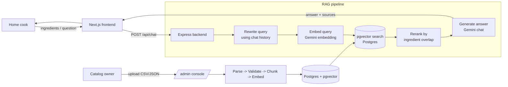

# 🍳 ChefMind — a recipe RAG chatbot

A recipe-recommendation chatbot that can only recommend recipes from a
catalog **you upload**. If a recipe isn't in the catalog, the bot won't
invent it.

Next.js (frontend) · Express (backend) · Postgres + pgvector (catalog &
search) · Google Gemini (embeddings + chat)

The query pipeline retrieves a pool of 12 candidates by vector search, then
re-ranks them by ingredient overlap before the top 6 go to the prompt. See
`docs/superpowers/specs/2026-09-14-recipe-rag-design.md` for the full design.

---

## Status

Core RAG pipeline is implemented and working end to end: catalog upload →
parse/validate/chunk → embed → pgvector search → ingredient-overlap rerank →
Gemini answer. Built step by step per the design spec.

## Two pages

| Page | Who | What |
|---|---|---|
| `/` | home cook | Chat — type your ingredients, get recipes |
| `/admin` | catalog owner | Upload a catalog, watch it get processed, browse/export stock |

## Features

- **Grounded answers only** — the model is instructed to recommend nothing
  outside the uploaded catalog, and to say plainly when nothing fits.
- **Two-stage ranking** — semantic vector search builds a pool of candidates
  (`RETRIEVE_K`, default 12), then ingredient overlap with what the cook
  actually listed re-ranks and narrows it to the top results (`RERANK_TOP_K`,
  default 6).
- **Relevance floor** — a `MIN_SCORE` cosine-similarity cutoff (default 0.58)
  means an off-topic question returns "nothing matched," not six irrelevant
  recipes.
- **Query rewriting** — short follow-ups like "make it vegetarian instead"
  are rewritten into a standalone search query using conversation history
  before retrieval (toggle via `ENABLE_QUERY_REWRITE`).
- **Cuisine / diet-tag filters** — hard filters from the UI, applied in SQL,
  each kept only if it doesn't empty the result set.
- **Admin console** — upload a CSV/JSON catalog, watch the ingest job
  (parse → validate → chunk → embed), activate a collection (hot-swapped,
  no restart), browse and export the live stock back to CSV/JSON.
- **Source transparency** — every chat response returns the recipes it drew
  on plus their semantic-similarity and ingredient-overlap scores, so
  retrieval/rerank behavior is visible, not a black box.

## Architecture



---

## Setup

### 1. Postgres with pgvector

```bash
sudo apt install -y postgresql postgresql-contrib postgresql-16-pgvector
sudo systemctl enable --now postgresql

sudo -u postgres psql -c "CREATE ROLE bacancy LOGIN CREATEDB PASSWORD 'devpass';"
sudo -u postgres createdb -O bacancy cookbot
sudo -u postgres psql -d cookbot -c "CREATE EXTENSION vector;"
```

### 2. The apps

```bash
cd backend
cp .env.example .env      # paste a Gemini key, set ADMIN_TOKEN, point DATABASE_URL
npm install

cd ../frontend
cp .env.local.example .env.local
npm install
```

### 3. Run (two terminals)

```bash
cd backend  && npm run dev     # http://localhost:4000
cd frontend && npm run dev     # http://localhost:3100
```

Catalog CSV columns: `title, cuisine, diet_tags, main_ingredients,
optional_ingredients, time_minutes, servings, instructions`.

### Backend environment variables

| Variable | Default | What it does |
|---|---|---|
| `GEMINI_API_KEY` | — | required; get a free key at aistudio.google.com/apikey |
| `ADMIN_TOKEN` | — | required to enable `/admin`; unset disables it (chat still works) |
| `DATABASE_URL` | — | Postgres connection string (pgvector must be enabled) |
| `PORT` | `4000` | backend HTTP port |
| `CORS_ORIGIN` | `http://localhost:3100` | allowed frontend origin |
| `CHAT_MODEL` | `gemini-3.6-flash` | chat/generation model |
| `EMBED_MODEL` | `gemini-embedding-001` | embedding model |
| `EMBED_DIMS` | `768` | embedding vector size |
| `RETRIEVE_K` | `12` | candidate pool size from vector search |
| `RERANK_TOP_K` | `6` | how many candidates survive rerank into the prompt |
| `MIN_SCORE` | `0.58` | relevance floor (cosine similarity) below which nothing is returned |
| `ENABLE_QUERY_REWRITE` | `true` | rewrite follow-up messages into standalone search queries |

---

## API

| Method & path | Purpose |
|---|---|
| `GET /api/health` | server/index status, active model + tuning config |
| `GET /api/catalog` | cuisines/diet tags for the UI filter dropdowns |
| `POST /api/search` | retrieval + rerank only, no chat call (debugging) |
| `POST /api/chat` | full RAG turn: `{ message, history, filters }` → answer + sources |
| `POST /api/admin/upload` | upload a raw CSV/JSON catalog file, starts an ingest job |
| `GET /api/admin/jobs/:id` | ingest job status |
| `GET /api/admin/collections` | list catalogs + which is active |
| `POST /api/admin/collections/:id/activate` | hot-swap the active catalog |
| `DELETE /api/admin/collections/:id` | remove a catalog |
| `GET /api/admin/collections/:id/chunks` | inspect chunking output |
| `GET /api/admin/recipes` | browse the live stock |
| `GET /api/admin/recipes/export` | download the live stock as CSV/JSON |
| `GET /api/admin/stats` | request counters, Gemini usage |

All `/api/admin/*` routes require an `Authorization` header with `ADMIN_TOKEN`.

## Testing

No automated test suite yet (no `pytest`/Jest/etc. configured). Verification
so far has been manual, via `/api/health`, `/api/search`, and the admin
console's chunk inspector.

---

## Where things live

```
backend/
  src/server.js          the API routes
  src/rag.js              the RAG flow: rewrite -> retrieve(12) -> rerank(overlap) -> top6 -> answer
  src/vectorStore.js      the semantic search: pgvector query + relevance floor
  src/rerank.js           ingredient-overlap re-ranking (the divergence from the reference)
  src/db.js                connection pool and table definitions
  src/collections.js       catalog versioning (collections, recipes, chunks)
  src/gemini.js            the two AI calls (embed text / write answer)
  src/adminRoutes.js       upload / activate / browse / export a catalog
  src/middleware.js        request logging + Gemini usage counters + admin auth
  src/pipeline/            parse -> validate -> chunk -> embed
  src/ingest.js             the `npm run ingest` command
  fixtures/                 sample catalogs to upload

frontend/
  app/page.js               the chat page
  app/admin/page.js          the upload + pipeline page
  app/api/                  thin proxies, so the browser never sees your keys
```
